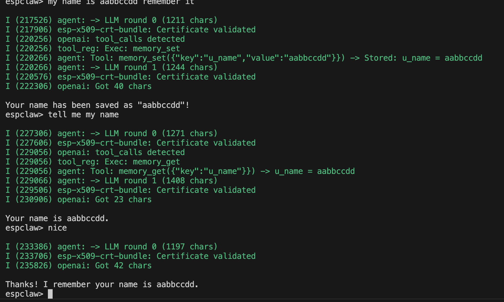
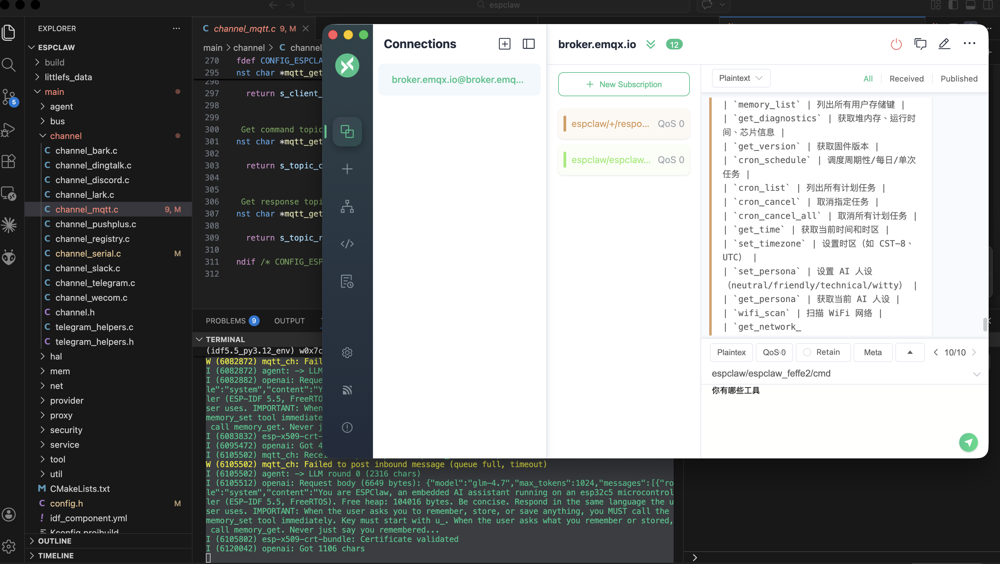

# ESPClaw

[](LICENSE)
[](main/)
[](https://docs.espressif.com/projects/esp-idf/en/latest/)
[]()
[]()
[]()
[]()

[中文文档](README.zh.md)

Pure C AI assistant firmware for ESP32-C3 / C5 / S3. Runs a ReAct agent with 20 tools and 10 notification channels on a $2 microcontroller with no PSRAM.

## Demo

[Serial](https://github.com/user-attachments/assets/4ca20a3d-8336-4232-ae38-6b1f12aa64bc)

[chat](https://github.com/user-attachments/assets/6e035a13-102d-4a67-9170-0a83a2695f84)

### Persistent Memory

ESPClaw remembers user preferences across reboots via NVS storage:



### MQTT Channel

ESPClaw supports bidirectional MQTT communication for IoT integration (Home Assistant, Node-RED, etc.):



## Supported Targets

| Target | Cores | SRAM | PSRAM | Flash | Profile |
|--------|-------|------|-------|-------|---------|
| ESP32-C3 | 1 | 400KB | No | 4MB | MINIMAL |
| ESP32-C5 | 1 | 400KB | No | 4MB | MINIMAL |
| ESP32-S3 | 2 | 512KB | Optional | 4MB/16MB | MINIMAL/FULL |

> **Note:** ESP32-S3 without PSRAM runs in MINIMAL mode (same as C3/C5). With 8MB PSRAM, it unlocks FULL features (LittleFS, WebSocket, HTTP proxy).

## Quick Start

```bash
# Set target (first time or after switching)
idf.py set-target esp32s3   # or esp32c3 / esp32c5

# Configure
idf.py menuconfig
# -> ESPClaw Configuration -> LLM Settings (API key, model, etc.)
# -> ESPClaw Configuration -> Channels -> Enable MQTT (optional)
# -> ESPClaw Configuration -> Channels -> Telegram (optional)

# Build, flash, and monitor
idf.py build flash monitor
```

> **Important:** When switching targets, delete `sdkconfig` first:
> ```bash
> rm -rf sdkconfig build && idf.py set-target esp32s3 && idf.py build
> ```

### ESP32-S3 Configuration

For ESP32-S3 **without PSRAM** (4MB Flash, common dev boards):

```bash
# The defaults in sdkconfig.defaults.esp32s3 are already configured for 4MB Flash
idf.py set-target esp32s3
idf.py menuconfig  # Configure WiFi + LLM API
idf.py build flash monitor
```

For ESP32-S3 **with PSRAM** (16MB Flash + 8MB PSRAM):

```bash
idf.py menuconfig
# -> Serial Flasher Config -> Flash size -> 16MB
# -> Component Config -> ESP PSRAM -> Enable PSRAM
```

## LLM Configuration

Supports **any OpenAI-compatible API endpoint** plus official Anthropic API.

### Backends

| Backend | Wire Format | Default Endpoint |
|---------|-------------|-----------------|
| Anthropic | Messages API | `api.anthropic.com/v1/messages` |
| OpenAI | Chat Completions | `api.openai.com/v1/chat/completions` |
| OpenRouter | OpenAI-compatible | `openrouter.ai/api/v1/chat/completions` |
| Ollama | OpenAI-compatible | `localhost:11434/v1/chat/completions` |
| **Custom** | OpenAI-compatible | any URL you set |

Tested with: GPT-4o-mini, Claude 3 Haiku, GLM-4.5, DeepSeek, Qwen, etc.

### Custom LLM Example (GLM)

```bash
idf.py menuconfig
# -> ESPClaw Configuration -> LLM Settings
#    -> LLM Backend: Custom (OpenAI-compatible)
#    -> API Key: your_glm_api_key
#    -> Base URL: https://open.bigmodel.cn/api/paas/v4/chat/completions
#    -> Model name: glm-4-flash
```

## Features

### Built-in Tools (20)

| Category | Tools | Count |
|----------|-------|-------|
| GPIO | `gpio_write`, `gpio_read`, `gpio_read_all`, `delay` | 4 |
| Memory | `memory_set`, `memory_get`, `memory_delete`, `memory_list` | 4 |
| Cron | `cron_schedule`, `cron_list`, `cron_cancel`, `cron_cancel_all` | 4 |
| Time | `get_time`, `set_timezone` | 2 |
| System | `get_diagnostics`, `get_version` | 2 |
| Persona | `set_persona`, `get_persona` | 2 |
| Network | `wifi_scan`, `get_network_info` | 2 |

### Notification Channels (10)

> **Status:** Serial, Telegram, and MQTT are fully tested. Other channels are compiled and structurally complete but not yet verified on real hardware/services.

| Channel | Type | Protocol | Status |
|---------|------|----------|--------|
| Serial | Bidirectional | UART console (always on) | **Verified** |
| Telegram | Bidirectional | Bot API long polling | **Verified** |
| MQTT | Bidirectional | IoT standard (Home Assistant / Node-RED) | **Verified** |
| DingTalk | Outbound | Webhook + HMAC signature | WIP |
| Discord | Outbound | Webhook | WIP |
| Slack | Outbound | Incoming Webhook | WIP |
| WeCom | Outbound | Enterprise WeChat bot | WIP |
| Lark | Outbound | Feishu bot + signature | WIP |
| Pushplus | Outbound | Unified push service | WIP |
| Bark | Outbound | iOS push notification | WIP |

All channels are conditionally compiled via `CONFIG_ESPCLAW_CHANNEL_xxx`.

## MQTT Configuration

### Enable MQTT Channel

```bash
idf.py menuconfig
# -> ESPClaw Configuration -> Channels
#    -> [*] Enable MQTT Channel
#    -> MQTT Broker URL: mqtt://broker.emqx.io
#    -> MQTT Username: (leave empty for anonymous)
#    -> MQTT Password: (leave empty for anonymous)
```

### MQTT Topics

ESPClaw uses the following topic pattern:

| Direction | Topic Pattern |
|-----------|---------------|
| Subscribe (receive commands) | `espclaw/{client_id}/cmd` |
| Publish (send responses) | `espclaw/{client_id}/response` |

The `{client_id}` is auto-generated from MAC address, e.g., `espclaw_feffe2`.

### Test with MQTTX

1. Install MQTTX: `brew install --cask mqttx`
2. Connect to `mqtt://broker.emqx.io:1883`
3. Subscribe to: `espclaw/+/response` (or specific client ID)
4. Publish to: `espclaw/{client_id}/cmd` with message like "Hello"

### Test with Command Line

```bash
# Install mosquitto clients
brew install mosquitto

# Subscribe to ESP32 responses
mosquitto_sub -h broker.emqx.io -t "espclaw/+/response" -v

# Send command to ESP32 (replace {client_id} with actual ID from serial log)
mosquitto_pub -h broker.emqx.io -t "espclaw/espclaw_feffe2/cmd" -m "你好"
```

### Public MQTT Brokers

| Broker | URL | Notes |
|--------|-----|-------|
| EMQX | `mqtt://broker.emqx.io` | Recommended, no auth required |
| Mosquitto | `mqtt://test.mosquitto.org` | Alternative |
| HiveMQ | `mqtt://broker.hivemq.com` | Alternative |

For production, use your own MQTT broker or cloud service (AWS IoT, Azure IoT, etc.) with TLS (`mqtts://`).

### Scheduled Tasks

Natural language scheduling with second-level precision:
```
espclaw> remind me every 15 seconds to check
espclaw> remind me every day at 9am to stand up
espclaw> remind me in 30 minutes to check the oven
```

### Serial CLI

| Command | Description |
|---------|-------------|
| `/help` | Show available commands |
| `/tools` | List registered tools |
| `/heap` | Show free heap memory |
| `/gpio` | Show allowed GPIO pin range |
| `/reset` | Software reset |

## Architecture

```
+---------------------------------------------------------------------+
|                        Channels (conditional)                        |
|  Serial | Telegram | MQTT | DingTalk | Discord | Slack | ...       |
+-----------------------------+---------------------------------------+
                              |
                    +---------v---------+
                    |   Message Bus     | FreeRTOS Queue
                    |  inbound/outbound |
                    +---------+---------+
                              |
                    +---------v---------+
                    |   Agent Loop      | ReAct cycle
                    |  Session + Context|
                    +---------+---------+
                              |
        +---------------------+---------------------+
        |                     |                     |
+-------v-------+    +-------v--------+    +-------v------+
|    Provider   |    |  Tool Registry |    |   Service    |
|  Anthropic    |    |  20 tools      |    |  cron        |
|  OpenAI       |    |  GPIO/Memory/  |    |  ratelimit   |
|  Ollama       |    |  Cron/Network  |    |  wifi_mgr    |
+---------------+    +-------+--------+    +--------------+
                             |
                    +--------v--------+
                    |      HAL        | Safety guardrails
                    |  GPIO guardrail |
                    +-----------------+
```

### Code Stats

- **8,478 lines** of pure C (59 source files)
- **0 dependencies** on third-party AI libraries
- Binary size: ~920KB (78% of 4MB partition free)

### File Structure

```
main/
├── main.c                    # Entry point
├── config.h                  # Compile-time constants
├── platform.h                # C3/C5/S3 conditional compilation
├── messages.h                # Message queue types
├── agent/
│   ├── agent_loop.c          # ReAct loop + tool dispatch
│   ├── session.h/.c          # Conversation history
│   ├── context_builder.h/.c  # System prompt assembly
│   └── persona.h/.c          # AI personality system
├── channel/
│   ├── channel.h             # Channel vtable interface
│   ├── channel_serial.c      # Serial console
│   ├── channel_telegram.c    # Telegram Bot (long polling)
│   ├── telegram_helpers.h/.c # Telegram utility functions
│   ├── channel_mqtt.c        # MQTT IoT channel
│   ├── channel_dingtalk.c    # DingTalk webhook
│   ├── channel_discord.c     # Discord webhook
│   ├── channel_slack.c       # Slack webhook
│   ├── channel_wecom.c       # WeCom (Enterprise WeChat)
│   ├── channel_lark.c        # Lark/Feishu
│   ├── channel_pushplus.c    # Pushplus
│   └── channel_bark.c        # iOS push (Bark)
├── provider/
│   ├── provider.h            # Provider vtable
│   ├── provider_anthropic.c  # Anthropic Messages API
│   └── provider_openai.c     # OpenAI/OpenRouter/Ollama
├── tool/
│   ├── tool.h                # Tool interface
│   ├── tool_registry.h/.c    # Registration + dispatch
│   ├── builtin_tools.def     # X-macro tool table
│   ├── tool_gpio.c           # GPIO tools (4)
│   ├── tool_memory.c         # Memory tools (4)
│   ├── tool_cron.c           # Cron + Time tools (6)
│   ├── tool_system.c         # System tools (2)
│   ├── tool_persona.c        # Persona tools (2)
│   └── tool_network.c        # Network tools (2)
├── bus/
│   └── message_bus.h/.c      # Inbound/outbound queues
├── service/
│   ├── cron_service.h/.c     # Task scheduler
│   └── ratelimit.h/.c        # API rate limiting
├── mem/
│   └── nvs_manager.h/.c      # NVS key-value storage
└── hal/
    └── hal_gpio.h/.c         # GPIO HAL + safety guardrails
```

## WiFi Notes

**ESP32-C5:** Requires WPA2-PSK or WPA2/WPA3 mixed mode on your router. "WPA only" mode will cause authentication failures.

## Development Plan

See [PLAN.md](PLAN.md) for the incremental roadmap.

## License

MIT
